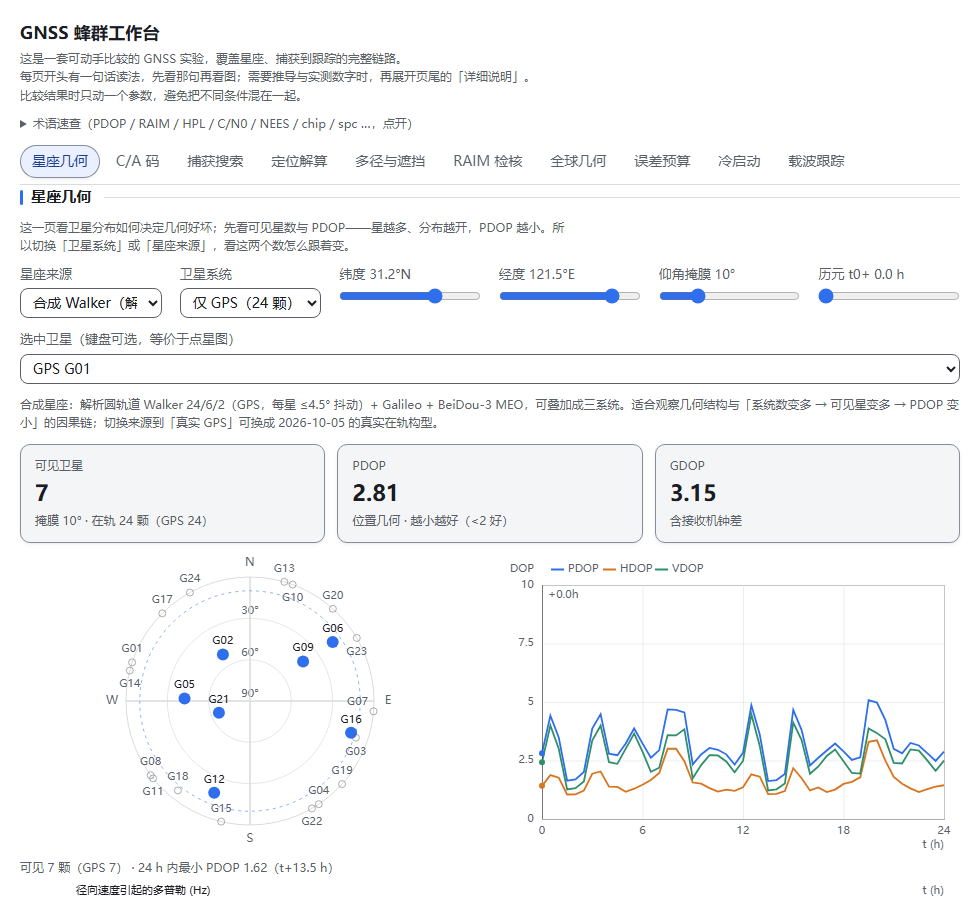
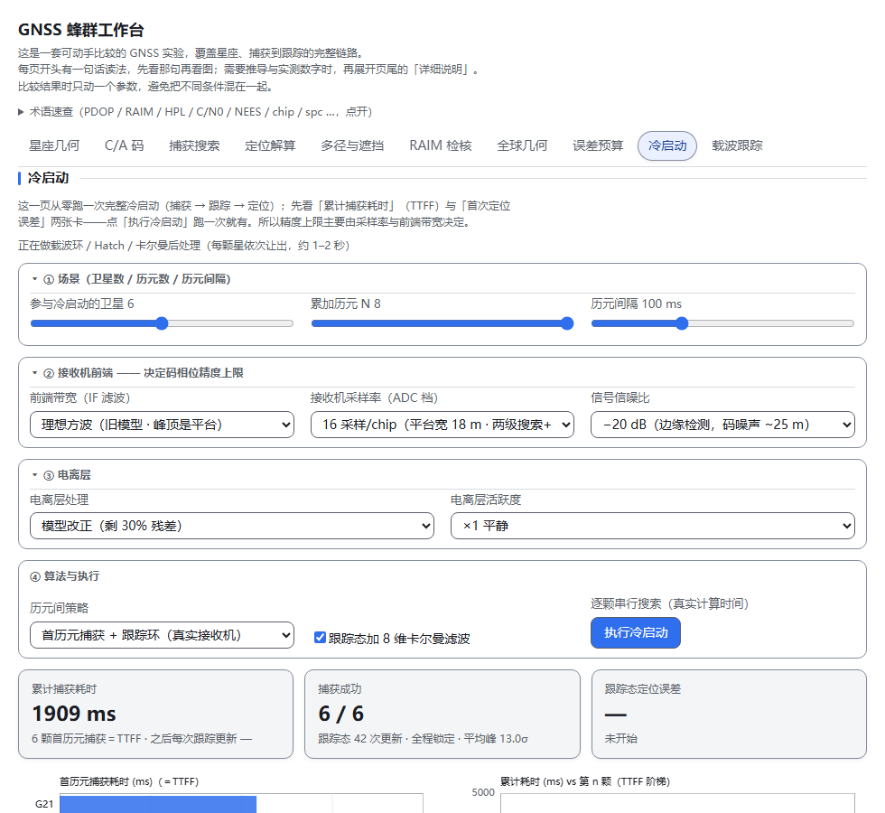

# GNSS 蜂群工作台 · GNSS Swarm Lab

> **单文件、离线可用的 GNSS 交互教学实验台**：10 个标签页，从星座几何一路做到冷启动与载波跟踪。
> A single-file, offline-ready interactive GNSS teaching workbench — 10 lab tabs, pure front-end, no external requests.



## 这是什么

一个**只用浏览器**的 GNSS 实验台：每个标签页都能**动手改参数、当场看数字与图变化**，用来把"书上的公式"变成"看得见的现象"。

- **10 个标签页**：星座几何 · C/A 码 · 捕获搜索 · 定位解算 · 多径与遮挡 · RAIM 检核 · 全球几何 · 误差预算 · 冷启动 · 载波跟踪
- **真的在算**：星座用解析圆轨道（可选 2026-10-05 真实 GPS 根数）、C/A 码按 IS-GPS-200 生成、捕获是二维网格相关、定位是最小二乘、还有 DLL/PLL/Hatch/8 维卡尔曼与 RAIM 保护限
- **核心算法都判据化**：`winners/` 里每个模块配一套 Node 判据，共 **21 套 / 505 项**
- **单文件离线**：`outputs/gnss-swarm-lab.html`（约 555 KB），双击即用；**0 外部请求**（无 CDN、无字体、无追踪）
- **可访问性**：10 个 tab 的 ARIA tablist + 方向键、roving tabindex、landmark（`nav`/`main`/`region`）、26 个 canvas 都有 `role=img` + `aria-label`、44 条术语速查、滑杆带 `aria-valuetext`

## 快速开始

| 方式 | 做法 |
|---|---|
| 本地直开（推荐） | clone 后**双击** `outputs/gnss-swarm-lab.html` |
| 在线试用 | <https://jx407.github.io/gnss-swarm-lab/>（GitHub Pages，已启用） |
| 内联进宿主页 | 用 `outputs/gnss-swarm-lab.inline.html`（片段，不是完整 HTML） |

## 10 个标签页能看什么

| 页 | 内容 | 动哪个控件 |
|---|---|---|
| 星座几何 | 天空图 + 24 h DOP 曲线、可见星/PDOP/GDOP | 卫星系统（G/GE/GEC）、星座来源、纬度/掩膜/时刻 |
| C/A 码 | 自相关尖峰、互相关底噪、码片条 | 换 PRN 对 |
| 捕获搜索 | 码相位×多普勒搜索面、相关剖面 | 信噪比、多普勒、码相位 |
| 定位解算 | 等权 vs 高程加权、电离层三情景 | 伪距噪声 σ、卫星数、ISB、电离层活跃度 |
| 多径与遮挡 | 反射几何、额外延迟、偏差量级 | 墙距/墙高/方位 |
| RAIM 检核 | 归一化残差、杠杆、HPL/VPL vs 告警限 | 给某颗星注入粗差、σ |
| 全球几何 | 16 个站点 24 h 中位 PDOP（含 95 分位） | 纬度、时刻 |
| 误差预算 | 电离层延迟曲线、改正比例、双频代价 | 载波、改正比例、预设 |
| 冷启动 | 从零捕获→跟踪→定位：TTFF 阶梯、精度阶梯（码→载波平滑→卡尔曼） | 前端带宽、ADC 档、信噪比、历元数 |
| 载波跟踪 | IQ 星座、相位误差、鉴相器、Hatch 平滑 | 环路阶数、鉴相器、C/N0、周跳 |



## 重建（可选）

```bash
bash work/gnss-swarm/build-all.sh
```
脚本用 `work/gnss-swarm/{shell.html,app/*,winners/*}` 打包出 `outputs/` 两个产物，并刷新 `docs/index.html`（Pages 入口）。
> 脚本里给的是本机 node 绝对路径，换机器请设置 `NODE=/path/to/node` 或直接改脚本第一行的 `NODE=`。

## 自证（判据怎么跑）

```bash
cd work/gnss-swarm
bash tests/run-all.sh                  # 21 套 Node 判据（核心算法）
node qa/check14.js                     # …到 check25.js：12 套浏览器判据（需 Playwright/Chromium）
node qa/probe-layout2.js               # 10 页 × 3 宽度版面（溢出/高度/空画布）
node qa/probe-chrome.js                # 5 宽度骨架（标题/导航/术语块/横向溢出）
node qa/probe-xoverflow.js             # #gnss-lab 内部溢出
node qa/probe-sweep.js                 # 极端参数档扫描（控件推到 max/min）× 2 宽度：文字越界 + 互压
node qa/probe-coldsatclip.js           # 冷启动图文字越界
node qa/probe-gecko.js / probe-webkit.js   # 可选：Gecko / WebKit 跨引擎（需 playwright install firefox webkit）
```
探头默认指向 `outputs/gnss-swarm-lab.html`；换产物时改脚本顶部的 `PAGE` 常量即可。

## 目录

```
outputs/            交付物：gnss-swarm-lab.html（独立版）/ .inline.html（宿主内联片段）
docs/               README 截图 + index.html（GitHub Pages 入口，由 build-all.sh 生成）
work/gnss-swarm/    源码与判据
  ├─ shell.html     页面骨架（10 个面板、术语速查、附录）
  ├─ app/           样式 + 绘图模块（含 C.label/labelTick/labelFit 等绘图基元）
  ├─ winners/       判据化核心算法（manifest.txt 决定打包哪些）
  ├─ tests/         21 套 Node 判据
  ├─ qa/            check14–25 与各类探头（*.js）
  ├─ CONTRACT-*.md  各模块的行为契约（判据依据）
  └─ HANDOFF.md     八轮开发/审计全过程记录（含"哪些判据曾判错"）
review/ds41/        独立子代理审计报告（*.md 与它们的探针脚本）
```

## 已验证（2026-10-07/08，绑定产物 SHA-256 `9e3150ad…`）

- **判据**：Node **21 套全绿**；浏览器判据 **check14–25 全通过**（每套控制台问题 0）
- **图表文字体检**：320 / 360 / 420 / 980 四档全部 **0 越界 / 0 互压**；**极端参数档（2 宽度 × 15 场景）同样 0 / 0**
- **三引擎**：Blink（Chromium 151 / Chrome 154 / Edge 149）、Gecko（Firefox 153）、WebKit 26.5 —— **console error/warning、pageerror、requestfailed 全 0**；加载 58–315 ms；`#gl-sky-pdop` 三引擎都是 `2.81`
- **冷启动数值跨引擎一致**：Gecko 与 WebKit 逐位相同，与 Blink 相对差 ≤ **6.3e-8**（浮点实现差异；`pllLocked` 都是 6/6）
- **抗压**：50 次标签风暴 / 4×40 次滑杆风暴 / 12 次缩放风暴 / 20 次 details 风暴 / 冷启动中途切换 / 键盘-only —— 0 报错、0 卡死、26/26 canvas 非空
- **版面**：320 / 360 / 420 / 768 / 980 / 1280 六档无横向溢出与内部溢出；窄屏导航 2 行、宽屏 1 行
- 完整证据链：`work/gnss-swarm/HANDOFF.md` 与 `review/ds41/`

## 已知限制

1. **冷启动页首次进入会自动算一次**（本机约 4–7 s，随引擎/负载变化：Chromium ≈5 s、Firefox ≈3.9 s、WebKit ≈7.1 s），期间有进度条与状态行，可切到别的标签页继续
2. **打印只输出当前标签页**（未跑过的面板本来就是空画布）
3. **真机触摸 / DPR>1 / 非 headless GPU** 未验证（44 px 触控命中区只在设备模拟里验过）
4. 术语速查 44 条仍非"零未释义词"，冷门词按需再补

## 许可

[MIT](LICENSE)。想换 Apache-2.0 / CC-BY-4.0 等，改 `LICENSE` 与本节即可。

## 致谢

本页与判据由 **Codex** 会话协作完成：核心算法逐条判据化在 `winners/`（21 套测试），
视觉、文案与版面经**多轮独立子代理审计**（ds4.1 × 9、Kimi × 3）后定稿，
每轮"改了什么 / 哪条判据曾经判错"都如实记在 `work/gnss-swarm/HANDOFF.md`。
